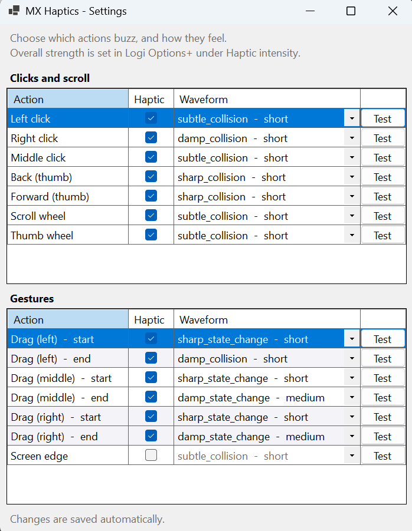

# MX Haptics

Universal haptic feedback for the **Logitech MX Master 4** — clicks, scroll and
gestures, in every application.

The MX Master 4 has a haptic motor. This plugin puts it to work on the things you
actually do with a mouse, everywhere you do them.

- **Universal.** Responds to real mouse input, so it works in every application —
  your editor, your browser, your file manager, a game. Nothing to configure
  per-app.
- **One install.** Download, double-click, done. The settings window ships inside
  the plugin — nothing else to fetch, nothing to sign into.
- **Yours to tune.** Every input can be switched off or given a different
  waveform, with a live preview so you choose by feel rather than by name.

### ⬇ [Download MX Haptics 1.0](https://github.com/PAAAAAAAAK/mxMasterHaptic/releases/download/v1.0.0/MxHaptics_1.0.lplug4)

Double-click the downloaded file, then **confirm the prompt in Logi Options+**.
Needs an MX Master 4, Logi Options+, and Windows x64.
[All releases →](https://github.com/PAAAAAAAAK/mxMasterHaptic/releases)

<p align="center">
  
</p>

## What it does

| Input | Default | On by default |
|---|---|---|
| Left click | `subtle_collision` | ✅ |
| Right click | `damp_collision` | ✅ |
| Middle click | `sharp_collision` | ✅ |
| Back (thumb) | `sharp_collision` | ✅ |
| Forward (thumb) | `sharp_collision` | ✅ |
| Scroll wheel | `subtle_collision` | ✅ |
| Thumb wheel | `sharp_collision` | ✅ |
| Drag start / end — left | `sharp_state_change` / `damp_state_change` | ✅ |
| Drag start / end — middle | as above | ✗ |
| Drag start / end — right | as above | ✗ |
| Screen edge | `subtle_collision` | ✗ |

Every entry can be switched off or given a different waveform.

Middle and right drag are off by default because in CAD and 3D tools those are
the orbit and pan gestures — held down and moved constantly — so haptics there
would be relentless for exactly the people who use them most. Screen edge is off
because it fires during ordinary cursor movement rather than a deliberate action.

### Synthesized detents on the thumb wheel

The vertical wheel has physical detents, so in ratchet mode the hardware paces
the haptics for us. The thumb wheel has none — it rolls smoothly — so pacing it
by time gives a constant buzz no matter how fast you roll it.

It's paced by **distance** instead: rotation accumulates and a tick fires once
per notch-equivalent. Roll slowly, ticks come slowly; roll fast, they come fast.
The haptic supplies the detents the hardware doesn't have.

## Installing

1. [**Download `MxHaptics_1.0.lplug4`**](https://github.com/PAAAAAAAAK/mxMasterHaptic/releases/download/v1.0.0/MxHaptics_1.0.lplug4)
   (or pick a version from [all releases](https://github.com/PAAAAAAAAK/mxMasterHaptic/releases)).
2. Double-click it.
3. **Confirm the install prompt that appears in Logi Options+.**

Step 3 is easy to miss — the prompt opens in Options+, not next to the file, so
it can look as though nothing happened.

To uninstall, right-click the same `.lplug4` and choose **Uninstall Plugin**.

### Requirements

- Logitech **MX Master 4** — the only Logitech mouse with a controllable haptic motor
- **Logi Options+** (installs the Logi Plugin Service)
- Windows x64

## Settings

Bind the **Haptic Settings** action (Options+ → *All Actions → MxHaptics →
Haptics*) to a key or an Actions Ring slot. Pressing it opens the settings
window.

Each row is one input: switch it off, or give it a different waveform. Waveforms
are labelled by character — `short`, `medium`, `long` — and selecting one plays
it immediately, so you tune by feel rather than by name. Changes save as you make
them; there's no Save button.

Clicks and scroll offer only the short waveforms. A long waveform there outlasts
the action that triggered it and the motor is still running when the next click
arrives, so those are left out rather than offered as a trap. Gestures, which
happen once per deliberate movement, get the full set.

Overall haptic **strength** is Logitech's own setting: Options+ → *Haptic
intensity* (Subtle / Low / Medium / High). This plugin doesn't duplicate it.

## Privacy and security

- **Mouse input only.** The hook is created with `GlobalHookType.Mouse`, so on
  Windows only `WH_MOUSE_LL` is installed. The keyboard hook is the same API
  keyloggers use and sees every keystroke including passwords; nothing here needs
  keystrokes, so it is never requested.
- **No network connections.** Nothing is sent anywhere. The settings window talks
  to the plugin over a local named pipe, which never touches the network stack.
- **No telemetry, no analytics, no data collection.** Preferences are stored
  locally.

## Building

```
dotnet tool install --global LogiPluginTool
dotnet build MxHapticsPlugin/src
```

`dotnet build` also builds the settings application, copies it into the plugin
output, writes a `.link` file into the Plugin Service's plugin directory and asks
it to reload — so the plugin runs straight from your build output. Use
`dotnet watch build` from `src/` while iterating.

To package a release:

```
dotnet build MxHapticsPlugin/src -c Release
logiplugintool pack ./MxHapticsPlugin/bin/Release ./dist/MxHaptics_1.0.lplug4
logiplugintool verify ./dist/MxHaptics_1.0.lplug4
```

### Project layout

- **`MxHapticsPlugin`** — the plugin. Targets plain `net10.0` with no desktop
  framework references (see below).
- **`MxHapticsSettings`** — the settings window, a WinForms executable bundled
  into the same package. Talks to the plugin over a local named pipe.

`HapticEvents.cs` and `Waveforms.cs` are compiled into **both** projects rather
than sent over the pipe, so both share one definition of what events exist and
only values cross the process boundary.

### Three things that will bite you

All are already handled, but each cost real time to diagnose:

1. **`LogiPluginTool` scaffolds `net8.0`, which will not compile.** The installed
   `PluginApi.dll` (6.4.x) is built against .NET 10, so referencing it from a
   `net8.0` project fails with `CS1705`. The target framework must match the
   Plugin Service's runtime.

2. **SharpHook ships native binaries for every platform**, and the Plugin
   Service's assembly resolver picks the first `runtimes/*/native/` match it
   finds — observed loading `win-arm64` on an x64 machine. The resulting
   `DllNotFoundException` is **fatal and kills LogiPluginService outright**.
   Fixed by pinning `RuntimeIdentifier=win-x64` together with
   `AppendRuntimeIdentifierToOutputPath=false` (the latter because setting a RID
   otherwise shifts the output path and breaks `pluginFolderWin: bin`).

3. **A WinForms reference in the plugin assembly fails `logiplugintool verify`.**
   The verifier inspects the assembly with a metadata resolver that can't load
   desktop framework assemblies, which blocks Marketplace submission. That's why
   the settings window is a separate executable rather than an in-process form.

Also note `Assembly.Location` is **empty** for a loaded plugin — the service uses
a collectible load context. Use the SDK's `AssemblyFilePath` instead.

## Why there's no hover feedback

Hover-over-element haptics were built and removed. UI Automation reports only
coarse containers (`Group`, `ToolBar`, `Pane`) for the applications where
hovering would actually be useful: Chrome doesn't build a detailed accessibility
tree unless a screen reader is present, so a whole web page reads as one
anonymous `Group` with no links or buttons in it.

Making it work would need per-application integrations — a browser extension, an
Electron hook, and so on. That would mean one app working and a thousand not,
which is the opposite of what this plugin is for.

## Roadmap

- [x] Click haptics (5 buttons)
- [x] Scroll wheel and thumb wheel
- [x] Drag gestures and screen edge
- [x] Settings window
- [ ] macOS support

## Licence

MIT — see [LICENSE](LICENSE). End user terms: [EULA](EULA.md).

Free, and staying free. Nothing is gated behind sponsorship — but if this saved
you an afternoon, a coffee is very welcome:
[GitHub Sponsors](https://github.com/sponsors/PAAAAAAAAK) ·
[Buy Me a Coffee](https://buymeacoffee.com/paaaaaaaak).
